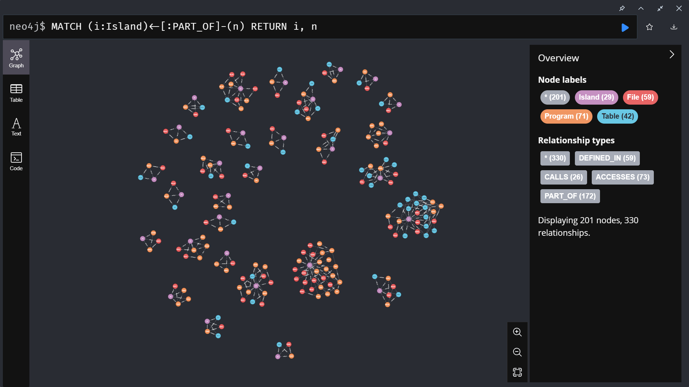
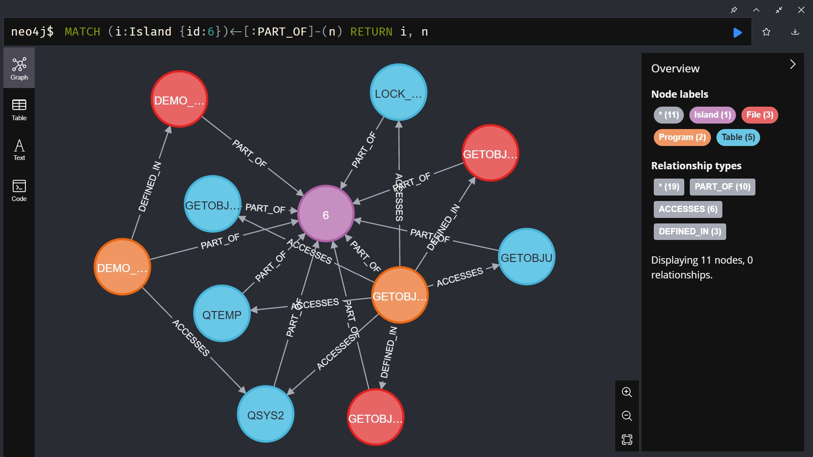

# RPG Island Detection - Legacy Code Dependency Analyzer

A Jupyter Notebook-based **prototype tool** for analyzing legacy RPG codebases by building a dependency graph in Neo4j and detecting "islands" of isolated code.

> **Note**: This is an experimental prototype. The parser uses regex-based pattern matching and may require improvements and customization for real-world RPG legacy codebases with complex syntax variations, non-standard formatting, or vendor-specific extensions.

## Purpose

**The main goal is to identify which parts of your legacy RPG codebase can be easily separated for modernization.**

Legacy RPG systems often grow organically over decades into monolithic codebases. Using **Graph Data Science**, this tool analyzes your codebase to find natural separation boundaries:

- **Identify isolated subsystems** that can be extracted independently
- **Find safe refactoring boundaries** with minimal cross-dependencies
- **Prioritize modernization efforts** by understanding connectivity patterns
- **Reduce risk** by separating code that's already loosely coupled

This tool works by:
1. Parsing RPG source files to extract dependencies
2. Building a graph database representation in Neo4j
3. Running cluster analysis (Weakly Connected Components) to identify "islands"
4. Visualizing which parts of your system are naturally separated



*Example output: Multiple isolated "islands" of varying sizes. Each cluster represents a subsystem with internal dependencies but no connections to other parts of the codebase. In this example, there are 264 nodes (programs and tables) organized into distinct islands.*

## What Are "Islands"?

Islands are **weakly connected components** discovered by graph analysis - groups of programs and tables that interact with each other but have **no dependencies** to the rest of the system.

**Why islands matter for separation:**
- **Ready for extraction**: Islands can be separated from the main system with zero impact on other code
- **Independent modernization**: Each island can be refactored, rewritten, or replaced independently
- **Natural service boundaries**: Islands often represent logical subsystems that map well to microservices
- **Risk reduction**: Separating islands first minimizes integration complexity and testing scope
- **Quick wins**: Small islands are candidates for rapid modernization or removal

## Architecture

```
┌─────────────────┐
│  Jupyter        │
│  Notebook       │ ──> Parses RPG Files
└────────┬────────┘
         │
         │ Neo4j Driver
         ▼
┌─────────────────┐
│  Neo4j Graph    │
│  Database       │ ──> Runs GDS Algorithms
│  + APOC + GDS   │
└─────────────────┘
```

### Components

- **DevContainer**: Isolated Docker environment with Python 3.10 and Neo4j 5.x
- **Neo4j**: Graph database with APOC and Graph Data Science (GDS) plugins
- **Jupyter Notebook**: Interactive analysis environment (`rpg_dependency_analyzer.ipynb`)

## Features

### Universal RPG Parser

The notebook includes a comprehensive parser that handles:

- **Fixed-format RPG** (Column 7-based syntax with F-specs)
- **Free-format RPG** (`**FREE` directive)
- **Mixed-mode** (`/FREE` and `/END-FREE` blocks)
- **SQL/RPG** (Embedded SQL statements)

### Extracted Relationships

| Relationship Type | Source → Target | Extracted From |
|-------------------|-----------------|----------------|
| `CALLS` | Program → Program | `CALL`, `CALLB`, `CALLP` operations |
| `ACCESSES` | Program → Table | F-specs, `DCL-F`, `CHAIN`, `READ`, `WRITE`, SQL statements |
| `DEFINED_IN` | Program → File | File metadata |
| `PART_OF` | Any → Island | Computed via GDS clustering |

Each relationship tracks the **line numbers** where dependencies occur for easy navigation.

## Getting Started

### Prerequisites

- Docker and Docker Compose
- VS Code with Remote - Containers extension (recommended)

### Setup

1. Clone this repository:
   ```bash
   git clone <repository-url>
   cd rpgisland
   ```

2. Open in DevContainer:
   ```bash
   code .
   # In VS Code: Ctrl+Shift+P → "Reopen in Container"
   ```

3. Place your RPG source files in the `./src` directory:
   ```
   ./src/
   ├── program1.rpgle
   ├── program2.sqlrpgle
   └── utils.rpg
   ```

4. Open and run the notebook:
   ```bash
   jupyter notebook rpg_dependency_analyzer.ipynb
   ```

### Usage

Execute the notebook cells in order:

1. **Cell 1**: Configuration and environment setup
2. **Cell 2**: Parse RPG files and extract dependencies
3. **Cell 3**: Load data into Neo4j with relationship tracking
4. **Cell 4**: Run Weakly Connected Components (WCC) analysis
5. **Cell 5**: Mark all nodes (Programs, Tables, Files) with island IDs

### Analyzing Results

After running the analysis, explore the graph in Neo4j Browser at `http://localhost:7474`:



*Detailed view of a single island (Island id:0) showing the relationships between nodes. The purple/pink central node represents the island itself, with programs (DEMO1, SETCR1, RDEMO, etc.) and tables (PCAA, SETCR1, GETCAT) connected via PART_OF relationships. You can also see CALLS and ACCESSES relationships between the programs and tables within this isolated subsystem.*

#### Example Cypher Queries

```cypher
// View all islands and their members
MATCH (i:Island)<-[:PART_OF]-(n)
RETURN i, n LIMIT 50

// Find the largest island
MATCH (i:Island)<-[:PART_OF]-(n)
RETURN i.id AS IslandID, count(n) AS Size
ORDER BY Size DESC

// Trace a dependency path
MATCH path = (p1:Program {name: 'MYPROG'})-[:CALLS|ACCESSES*]->()
RETURN path LIMIT 10

// Find orphaned programs (single-node islands)
MATCH (i:Island)<-[:PART_OF]-(p:Program)
WITH i.id AS IslandID, count(p) AS ProgramCount
WHERE ProgramCount = 1
RETURN IslandID, ProgramCount
```

## Project Structure

```
rpgisland/
├── .devcontainer/          # Docker environment configuration
│   ├── devcontainer.json   # VS Code container settings
│   ├── docker-compose.yml  # Neo4j + Python services
│   ├── Dockerfile          # Python container image
│   └── init-firewall.sh    # Network setup script
├── src/                    # Place your RPG source files here
├── rpg_dependency_analyzer.ipynb  # Main analysis notebook
├── requirements.txt        # Python dependencies
├── CLAUDE.md              # Development context
└── README.md              # This file
```

## Technical Details

### Supported File Types

- `.rpgle` - Free-format RPG IV
- `.sqlrpgle` - SQL/RPG IV
- `.rpg` - Fixed-format RPG
- `.clp` - CL Programs
- `.clle` - CL/LE Programs

### Graph Schema

```
                    ┌─────────┐
                    │ Island  │
                    └─────────┘
                         ↑
                         │ PART_OF (from all node types)
            ┌────────────┼────────────┐
            │            │            │
        ┌───────┐   ┌─────────┐   ┌───────┐
        │ File  │   │ Program │   │ Table │
        └───────┘   └─────────┘   └───────┘
            ↑            │ │           ↑
            │            │ └───────────┘
            │            │   ACCESSES
            │            │
            │            └─────> Program (CALLS)
            │            ↓
            └──────── DEFINED_IN
```

**Relationships:**
- `Program -[:DEFINED_IN]-> File` - Programs are defined in source files
- `Program -[:CALLS]-> Program` - Programs call other programs
- `Program -[:ACCESSES {action}]-> Table` - Programs access database tables (with action: READ/WRITE/UPDATE/SQL)
- `File/Program/Table -[:PART_OF]-> Island` - All nodes belong to an island (computed by WCC algorithm)

### Algorithms Used

- **Weakly Connected Components (WCC)**: Identifies disconnected clusters in the graph
- Available via Neo4j Graph Data Science library

## Limitations

### Parser Limitations (Prototype Status)

This is a **prototype parser** designed as a proof-of-concept. For real-world RPG legacy codebases, you may need to enhance the parser to handle:

- **Complex dynamic calls**: Computed program names, procedure pointers, indirect calls
- **Vendor-specific extensions**: IBM i-specific opcodes, third-party libraries, custom extensions
- **Non-standard formatting**: Unusual indentation, mixed character encodings, legacy dialects
- **Conditional compilation**: Compiler directives, conditional includes, preprocessor macros
- **Copy members and includes**: `/COPY` and `/INCLUDE` directives spanning multiple files
- **Service programs and modules**: Procedure exports, binding directories, ILE concepts
- **Data structures and prototypes**: Complex parameter passing, by-value vs by-reference

### General Limitations

- Does not analyze runtime behavior or data flow
- Requires GDS plugin to be properly installed in Neo4j
- Fixed-format parsing assumes standard column positions (6-80 character layout)
- May produce false positives/negatives depending on code quality and conventions

## License

Do whatever you want with this. This project is provided as-is for educational and analysis purposes.

## Contributing

This is a prototype tool. Contributions are very welcome!

Areas where help is needed:
- **Parser improvements** - [Please help improve the RPG parser!](https://github.com/yourusername/rpgisland/issues) The regex-based approach works for basic cases but needs enhancement for real-world codebases :)
- Additional RPG language support (more opcodes, edge cases)
- Enhanced visualization options
- Performance optimization for large codebases

---

**Note**: This tool is designed for **analysis and understanding** of legacy codebases. Always validate findings against actual system behavior before making refactoring decisions.
